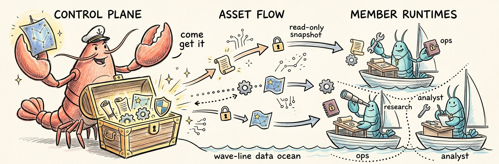
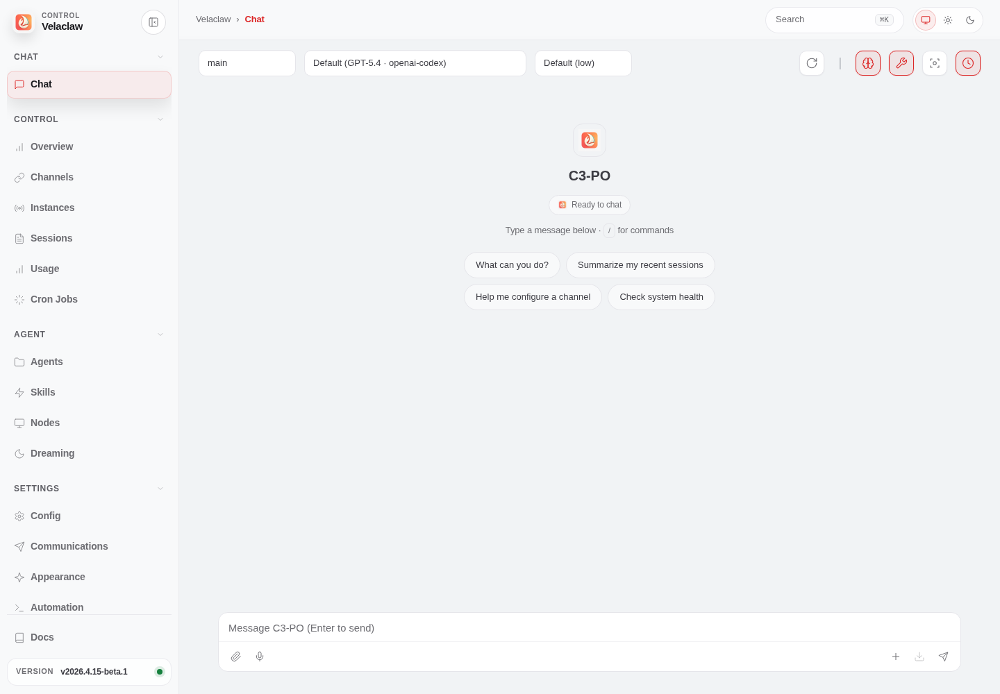
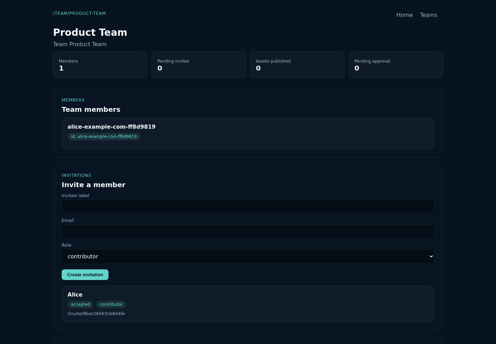
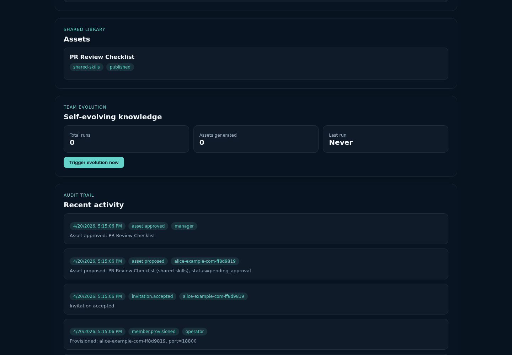
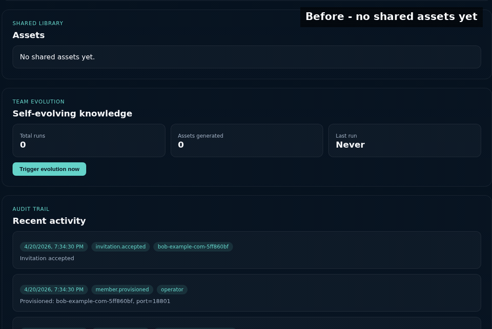

<p align="center">
  
</p>

<h1 align="center">VelaClaw</h1>

<p align="center">
  <b>一个会随你的团队一起进化的本地 AI 运行时。</b>
</p>

<p align="center">
  <a href="https://www.npmjs.com/package/velaclaw"></a>
  
  
  
  
</p>

<p align="center">
  
  
  
  
  
  
  
</p>

<p align="center">
  <a href="#-演示">演示</a> &nbsp;·&nbsp;
  <a href="#-安装">安装</a> &nbsp;·&nbsp;
  <a href="#-进化引擎">进化引擎</a> &nbsp;·&nbsp;
  <a href="#-团队协作">团队协作</a> &nbsp;·&nbsp;
  <a href="#-skills检索与-clawhub">ClawHub</a> &nbsp;·&nbsp;
  <a href="MANIFESTO.md">设计理念</a> &nbsp;·&nbsp;
  <a href="README.md">English</a>
</p>

<br/>

---

<br/>

> 很多团队已经开始使用 AI，但使用方式仍然高度个人化：知识散落在各自的聊天记录里，流程难以复用，协作中也缺少稳定的沉淀机制。
>
> VelaClaw 试图解决的，就是这个问题。
>
> 它可以运行在你自己的机器上，连接你已经在用的模型，并把技能、记忆和工作流留在本地工作环境里。团队加入之后，这套能力也不会变成一个混在一起的共享池：每个成员仍然有独立运行时和私有记忆，而真正有价值的经验，会在整理和审核之后，逐步进入团队共享的知识库。
>
> 它不是再开一个 AI 聊天窗口，而是把 AI 从个人工具变成可持续积累的团队能力。

<br/>

## ✨ VelaClaw 提供什么

VelaClaw 把本地 AI 运行时、会自己生长的知识进化引擎，以及带治理的团队协作层放进了同一套系统里。

<br/>

### 🧬 进化引擎

<p><b>会自己写自己的知识。</b></p>

VelaClaw 增加了一条进化链路，可以根据匿名化后的团队 digest 和重复出现的会话模式，起草新的共享资产。

<table>
  <tr>
    <td width="50%" valign="top">
      <h4>📝 从真实工作里自动起草</h4>
      <p>引擎从你真实的会话模式里提炼新技能、记忆、工作流 —— 不是从空白 prompt 凭空编的。</p>
    </td>
    <td width="50%" valign="top">
      <h4>🛡️ 匿名化 digest 进入，审核后的资产流出</h4>
      <p>进化链路处理的是匿名化后的 topic 和 summary。每份草稿都要先进入人工审核队列，才能进共享池。</p>
    </td>
  </tr>
  <tr>
    <td width="50%" valign="top">
      <h4>♻️ 增量生长，不重复</h4>
      <p>后续运行会跳过已经生成的内容。引擎让知识库长大，而不是反复重写。</p>
    </td>
    <td width="50%" valign="top">
      <h4>📡 自动分发给团队</h4>
      <p>审核通过的资产会通过共享资产分发链路，在后续对话中同步回成员运行时。</p>
    </td>
  </tr>
</table>

<p>结果是：共享知识库可以持续增长，而不需要团队手工维护每一份资产。</p>

<br/>

### 👥 团队协作

<p><b>多人协作，但不牺牲隐私。</b></p>

VelaClaw 的设计目标，是让知识可以共享，而成员运行时仍通过容器边界、策略和显式发布流保持隔离。

<table>
  <tr>
    <td width="50%" valign="top">
      <h4>📦 成员运行时完全隔离</h4>
      <p>每位成员一个 Docker 沙箱：<code>cap_drop: ALL</code>、只读 FS、不挂宿主机 socket、互不共享内存。控制平面通过生成状态、API 和已发布资产来协调成员，而不是依赖直接读取原始聊天内容。</p>
    </td>
    <td width="50%" valign="top">
      <h4>🚦 受控的发布流转</h4>
      <p><b>提交 → 审核 → 批准 → 发布 → 分发。</b>任何内容都必须经过人工批准才能进共享池。</p>
    </td>
  </tr>
  <tr>
    <td width="50%" valign="top">
      <h4>🎭 7 种角色，含专属进化角色</h4>
      <p><code>viewer</code> · <code>member</code> · <code>contributor</code> · <code>publisher</code> · <code>manager</code> · <code>owner</code>，外加 <code>system-evolution</code> 专供进化引擎使用。</p>
    </td>
    <td width="50%" valign="top">
      <h4>🔍 15 种事件审计追踪</h4>
      <p>每次提议、审批、发布、成员变更、配额调整都会落日志、可查询。</p>
    </td>
  </tr>
  <tr>
    <td width="50%" valign="top">
      <h4>💓 心跳与配额</h4>
      <p>成员上报健康状态和每日消息用量，过期节点在 UI 里浮出，配额按成员粒度强制。</p>
    </td>
    <td width="50%" valign="top">
      <h4>💾 一条命令备份与恢复</h4>
      <p><code>velaclaw team backup &lt;slug&gt;</code> 一键把全团队状态 —— 成员、资产、审计日志 —— 打进一个 tar.gz。</p>
    </td>
  </tr>
</table>

<br/>

### 📊 定位

<p>VelaClaw 是一套面向团队的本地优先运行时：隔离的成员运行时、受治理的共享知识、backup / restore，以及一个从匿名化 digest 起草可复用资产的进化引擎。</p>

<br/>

## 🎬 演示

| Demo                                           | 展示什么                                   | 适合什么场景                     |
| :--------------------------------------------- | :----------------------------------------- | :------------------------------- |
| [Demo 1](#demo-1-local-gateway-dashboard)      | 本地 gateway、浏览器 dashboard、第一次聊天 | 想先确认 VelaClaw 能在本机跑起来 |
| [Demo 2](#demo-2-team-workspace-member-invite) | 团队 workspace、成员邀请、控制平面 UI      | 想理解团队 runtime 模型          |
| [Demo 3](#demo-3-shared-asset-review-publish)  | 提交 → 审核 → 发布共享知识                 | 想理解团队治理闭环               |
| [Demo 4](#demo-4-evolution-engine)             | 会话 digest → 自动生成共享资产             | 想看知识如何随团队工作持续沉淀   |

<br/>

<a id="demo-1-local-gateway-dashboard"></a>

<details>
<summary><b>Demo 1：本地网关与 Dashboard</b> —— 本地 gateway、浏览器 dashboard、第一次聊天</summary>

<br/>

这个 demo 会从安装走到浏览器控制台，是验证 VelaClaw 能在本地跑起来、连接模型供应商、并通过 gateway 保持可用聊天会话的最快路径。

```bash
npm uninstall -g velaclaw
npm install -g velaclaw
velaclaw setup --wizard
```

在一个终端里启动 gateway：

```bash
velaclaw gateway run
```

在另一个终端里打开 dashboard：

```bash
velaclaw dashboard
```

如果浏览器没有自动打开，手动访问 **http://127.0.0.1:18789**。

dashboard 连接成功后，大致会是这个界面：

<p align="center">
  
</p>

在 Chat 页面里先发这条 prompt：

```text
用三条要点总结 VelaClaw 能做什么，然后给出一个安全的下一步。
```

你应该能看到模型回复流式出现在 dashboard 里。触发工具调用时，Control UI 会显示实时工具输出卡片；刷新页面后，会话仍由 gateway 保存和读取。

</details>

<a id="demo-2-team-workspace-member-invite"></a>

<details>
<summary><b>Demo 2：团队 Workspace 与成员邀请</b> —— 团队 workspace、成员邀请、控制平面 UI</summary>

<br/>

这个 demo 展示团队控制平面：管理者创建 workspace，打开团队 UI，邀请一位 contributor，并确认成员已经被 provision；整个过程不需要共享成员的私有聊天记录。

在一个终端里启动团队控制平面：

```bash
velaclaw init team-demo
cd team-demo
velaclaw start
```

控制平面默认监听 **http://127.0.0.1:4318**。

在另一个终端里进入同一个 `team-demo` 目录：

```bash
velaclaw team create \
  --name "Product Team" \
  --slug product-team \
  --manager-label "Team Lead"

velaclaw team invitations create product-team \
  --invitee-label "Alice" \
  --member-email alice@example.com \
  --role contributor

velaclaw team invitations accept <invite-code> --identity-name "Alice"
velaclaw team show product-team
velaclaw team members list product-team
```

预期结果：

```text
Created team: product-team (Product Team)
Invitation created: code=<invite-code> (alice-example-com-...)
Accepted: memberId=alice-example-com-... port=18800
Team: Product Team (product-team)
Members: 1
Pending invitations: 0
```

打开 **http://127.0.0.1:4318/team/product-team**，可以查看成员、邀请、共享资产、进化状态和审计日志：

<p align="center">
  
</p>

这是从单人使用进入团队治理的分界点：每个成员拥有独立 runtime，而团队可见资产和操作通过控制平面管理。

</details>

<a id="demo-3-shared-asset-review-publish"></a>

<details>
<summary><b>Demo 3：共享资产审核与发布</b> —— 提交、审核、发布共享知识</summary>

<br/>

这个 demo 展示可复用团队知识如何进入受治理的 shared asset 流程。contributor 提交一份 checklist，manager 审批后，这份资产会成为已发布的团队知识。

从 Demo 2 创建好的 `product-team` workspace 开始，先获取成员 id：

```bash
velaclaw team members list product-team
```

然后以该成员身份提交一份共享 skill：

```bash
velaclaw team assets propose product-team \
  --category shared-skills \
  --title "PR Review Checklist" \
  --submitted-by-member-id <member-id> \
  --content "Review pull requests by checking tests, migrations, auth boundaries, rollout risk, and rollback plan."
```

查看审核队列，审批提案，并确认它已经发布：

```bash
velaclaw team assets list product-team
velaclaw team assets approve product-team <asset-id> --approved-by-member-id manager
velaclaw team assets list product-team
velaclaw team show product-team
```

预期结果：

```text
Asset <asset-id> → pending_approval
<short-id> shared-skills [pending_approval] PR Review Checklist
Approved: <asset-id> → published
<short-id> shared-skills [published] PR Review Checklist
Assets — drafts: 0, pending: 0, published: 1
```

团队页面会在 shared library 中展示这份资产，并在 audit trail 中记录提交和审批动作：

<p align="center">
  
</p>

这是团队治理的核心闭环：有价值的工作可以沉淀成团队能力，但必须先经过显式审核，再进入已发布共享库。

</details>

<a id="demo-4-evolution-engine"></a>

<details>
<summary><b>Demo 4：进化引擎</b> —— 从重复会话模式生成共享资产</summary>

<br/>

这个 demo 展示自进化知识链路：VelaClaw 收集团队成员会话的匿名 digest，让已配置的模型提取可复用知识，再把生成的 memory 或 skill 资产发布回团队共享库。

前置条件：

- 已有一个团队 workspace，可参考 Demo 2。
- 成员 runtime 中有足够近期会话 digest；测试时也可以强制触发。
- 团队控制平面已经配置可用模型供应商。

可以在团队页面点击 **Trigger evolution now**，也可以调用本地控制平面 API：

```bash
curl -X POST http://127.0.0.1:4318/api/teams/product-team/evolution/trigger
velaclaw team assets list product-team
```

下面的 GIF 使用一个本地种子 demo workspace，里面有两类匿名会话模式：事故 rollback 顺序和发布复盘结构。进化运行后，VelaClaw 发布了一份 shared memory 和一份 shared skill：

<p align="center">
  
</p>

这里的关键约束是：原始私有聊天不会直接进入共享池。进化引擎处理的是 topic 和 summary，生成的资产以 system 身份进入共享库，并在团队 audit trail 中留下记录。

</details>

<br/>

## 🚀 安装

```bash
npm uninstall -g velaclaw
npm install -g velaclaw
velaclaw setup --wizard
velaclaw gateway run
```

随后打开 **http://127.0.0.1:18789**。

<br/>

向导会带你走完整套配置，把你本来要手动决定的每一项都问一遍：

| 步骤                             | 做什么                                                                                                                                                       |
| :------------------------------- | :----------------------------------------------------------------------------------------------------------------------------------------------------------- |
| **1. 安全确认**                  | 一次性让你确认信任模型（默认是个人单人使用；如果开放 DM 或启用工具，trust boundary 要自己收紧）。                                                            |
| **2. Flow**                      | _QuickStart_ 用安全默认值（loopback、token、`18789` 端口），只问必要的；_Manual_ 一项项手动配。                                                              |
| **3. Mode**                      | 本机跑 gateway，还是连接远程 gateway。                                                                                                                       |
| **4. Gateway**                   | 端口、绑定方式（loopback / 局域网 / Tailnet / 自定义）、token 或密码认证。Token 自动生成。                                                                   |
| **5. Provider**                  | 用自己的 API key（OpenAI、Anthropic、DeepSeek、Gemini、OpenRouter、LiteLLM，或任意 OpenAI 兼容端点），或复用已有的 CLI 登录（`claude`、`codex`、`gemini`）。 |
| **6. Channels、skills、plugins** | 可选。可跳过。之后再配也行。                                                                                                                                 |
| **7. Health probe**              | 向导会实际连一下刚配好的 gateway，确认可达再退出。                                                                                                           |

所有选择都会写入当前 active 的 Velaclaw 配置文件。需要固定位置时可以设置 `VELACLAW_CONFIG_PATH`；否则 CLI 使用默认本地配置路径。可以随时重跑 —— 向导支持保留现有值、只改某部分、或者整体 reset。之后想调整凭证、channels、gateway 或 agent 默认值，随时跑 `velaclaw configure`。

<details>
<summary><b>非交互式安装</b>（CI / 脚本场景）</summary>

<br/>

```bash
velaclaw onboard --non-interactive --accept-risk \
  --mode local \
  --auth-choice openai-api-key --openai-api-key sk-... \
  --gateway-bind loopback --gateway-port 18789
```

完整参数列表跑 `velaclaw onboard --help`，包含 Codex CLI、Anthropic CLI、Ollama、自定义 provider 等流程。

</details>

<details>
<summary><b>源码安装</b></summary>

<br/>

```bash
git clone https://github.com/Zavianx/velaclaw.git
cd velaclaw
pnpm install && pnpm build && pnpm link --global
```

需要 Node.js 22+ 和 pnpm 9+。

</details>

<br/>

## 🧩 Skills、检索与 ClawHub

VelaClaw 可以加载本地 skills，也可以从 [ClawHub](https://clawhub.ai) 安装 registry skills，并把经过团队认可的 skills 作为共享资产分发给成员。

```bash
velaclaw skills search "financial research"
velaclaw skills install <skill-slug>
velaclaw skills update --all
```

团队模式下，control plane 可以把 ClawHub 接入 `shared-skills` 使用的同一套共享资产系统。成员只会拿到 materialized skill files，放在自己的隔离 workspace 里；不会拿到 ClawHub token。

```bash
VELACLAW_TEAM_CLAWHUB_SKILLS_ENABLED=1
VELACLAW_CLAWHUB_TOKEN=clh_...
```

实时检索和网页抓取由 `research_task`、`web_search`、`web_fetch` 配合完成。如果成员运行在 Docker、TUN 或 fake-IP 代理环境中，需要公网抓取时，可以开启 `tools.web.fetch.useEnvProxy`，并把可信的 `HTTP_PROXY` / `HTTPS_PROXY` 环境变量传给成员运行时，让外站访问走 operator 控制的代理，而不是本地 DNS pinning。

详细配置见 [ClawHub](docs/tools/clawhub.md)、[Skills](docs/tools/skills.md) 和 [Web Fetch](docs/tools/web-fetch.md)。

<br/>

## 👥 团队配置

<sub>四条命令拉起一个团队。能力细节见上方<a href="#-团队协作">团队协作</a>章节。</sub>

```bash
# 1. 构建成员运行时镜像
docker build -t velaclaw-member-runtime:local .

# 2. 初始化团队 workspace 并启动控制平面
velaclaw init my-workspace && cd my-workspace
velaclaw start                                   # 控制平面在 :4318

# 3. 创建团队
velaclaw team create --name "我的团队"

# 4. 创建邀请，让成员那边 accept
velaclaw team invitations create my-team \
  --invitee-label "小明" --member-email xiaoming@example.com --role contributor
velaclaw team invitations accept <邀请码>
```

正式团队部署时，建议固定这些默认项：

- 只运行一个明确的 team control plane，并让成员通过 `VELACLAW_TEAM_CONTROL_BASE_URL` 指向它。
- 上游模型/API 凭证留在 control plane 侧；成员 runtime 走 team model gateway，不直接持有 provider key。
- 在接受成员前，先构建或发布稳定的 member runtime image。
- 如果 Docker 内成员需要公网抓取，传入可信 `HTTP_PROXY` / `HTTPS_PROXY`，并设置 `tools.web.fetch.useEnvProxy: true`。
- 如果启用 ClawHub 共享 skills，只在 control plane 设置 `VELACLAW_TEAM_CLAWHUB_SKILLS_ENABLED=1` 和 `VELACLAW_CLAWHUB_TOKEN`。
- 移除成员时使用 `velaclaw team members remove <slug> <memberId>`，它会停止对应 runtime 并删除成员 workspace。

<br/>

## 📚 参考

<details>
<summary><b>环境变量</b></summary>

<br/>

| 变量名                                 | 作用                                  | 默认值           |
| :------------------------------------- | :------------------------------------ | :--------------- |
| `VELACLAW_ROOT`                        | 工作区根目录                          | 自动检测         |
| `VELACLAW_CONFIG_PATH`                 | 覆盖 active config 文件路径           | CLI 默认值       |
| `VELACLAW_ADMIN_TOKEN`                 | 控制平面认证 token                    | localhost 下开放 |
| `VELACLAW_TEAM_CONTROL_BASE_URL`       | 成员访问 control plane 的 base URL    | 自动生成         |
| `VELACLAW_TEAM_CLAWHUB_SKILLS_ENABLED` | 通过团队共享资产暴露 ClawHub skills   | 关闭             |
| `VELACLAW_CLAWHUB_TOKEN`               | control plane 使用的 ClawHub token    | —                |
| `VELACLAW_MEMBER_INHERIT_PROXY`        | 将可信代理环境变量写入成员 runtime    | 关闭             |
| `HTTP_PROXY` / `HTTPS_PROXY`           | 网页抓取使用的可信代理                | —                |
| `OPENAI_API_KEY`                       | OpenAI                                | —                |
| `ANTHROPIC_API_KEY`                    | Anthropic                             | —                |
| `BRAVE_API_KEY`                        | `web_search` 的 Brave Search provider | —                |
| `FIRECRAWL_API_KEY`                    | 可选的 `web_fetch` fallback provider  | —                |
| `PORT`                                 | 控制平面端口                          | `4318`           |

</details>

<details>
<summary><b>CLI 命令</b></summary>

<br/>

```bash
# 网关（单人使用）
velaclaw gateway run [--bind loopback|lan] [--port 18789]

# 控制平面（团队使用）
velaclaw init <目录>
velaclaw start [--port 4318]

# 团队
velaclaw team list
velaclaw team create --name "名称"
velaclaw team show <slug>
velaclaw team backup <slug>
velaclaw team restore <归档>

# 成员
velaclaw team members list <slug>
velaclaw team members quota <slug> <id> [--daily-messages N] [--status active|paused]
velaclaw team members remove <slug> <id>

# 邀请
velaclaw team invitations create <slug> --invitee-label "姓名" --member-email 邮箱
velaclaw team invitations accept <邀请码>

# 共享资产
velaclaw team assets list <slug>
velaclaw team assets propose <slug> --category shared-skills --title "标题" --content "..."
velaclaw team assets approve <slug> <id>
```

</details>

<details>
<summary><b>项目文档</b></summary>

<br/>

- [MANIFESTO.md](MANIFESTO.md) —— VelaClaw 为什么存在
- [CONTRIBUTING.md](CONTRIBUTING.md) —— 如何贡献
- [SECURITY.md](SECURITY.md) —— 漏洞上报
- [CHANGELOG.md](CHANGELOG.md) —— 更新日志

</details>

<br/>

---

<p align="center">
  <sub>以 <a href="LICENSE">MIT 协议</a> 发布。</sub>
</p>
<p align="center">
  <sub>如果 VelaClaw 对你有用，欢迎在 <a href="https://github.com/Zavianx/velaclaw">GitHub</a> 上点一个 ⭐。</sub>
</p>
