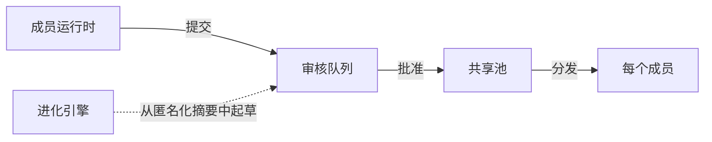

# 团队

Velaclaw 开箱即用是一个**个人 AI 运行时**，给一个人用。当人数增加时，它会长成一个团队规模的系统，但不会丢掉个人运行时通常会牺牲的两个性质：

- **对话保持私有**——靠容器边界，不靠 policy。
- **共享知识保持受控**——`提交 → 审核 → 批准 → 分发`，由人决定什么进共享池。

这一页讲清楚每个零件是怎么运转的。

## 私有资产 vs 共享资产

你积累的每一个技能、每一条记忆、每一个工作流，都属于以下两种身份之一。

<Columns cols={2}>
  <Card title="私有资产" icon="lock">
    你自己的技能、记忆、工作流。它们留在**你的**运行时里，不会上传，
    也不会被其他团队成员看到。这是每一项积累知识的默认状态。

  </Card>
  <Card title="共享资产" icon="users-round">
    你**主动提交**、并经团队审核批准的条目。批准后会在每个成员
    下次会话时同步到他们的运行时。

  </Card>
</Columns>

资产的文件系统布局直接反映这点：

```text
members/<member>/runtime/workspace/
├── private-memory/      ← 你的；只待在这里
├── private-skills/      ← 你的；只待在这里
├── private-tools/       ← 你的；只待在这里
└── private-docs/        ← 你的；只待在这里

teams/<slug>/assets/
├── items/<asset-id>/    ← 规范存储（Source of Truth）
└── current/             ← 按类型发布的投影
    ├── shared-memory/
    ├── shared-skills/
    ├── shared-tools/
    ├── shared-workflows/
    └── shared-docs/
```

共享一个条目永远是主动的动作；从来不会自动发生。

## 隔离的成员运行时

每个团队成员跑在自己的 Docker 容器里，默认非常严格：

- `cap_drop: ALL`
- 只读文件系统
- 不挂宿主 socket，不挂特权 namespace
- 私有内存卷，其他容器读不到

控制平面通过生成的状态、API 和**已发布资产**协调成员——而不是直接访问任何人的原始对话。

## 发布流程



四个阶段，全部都进审计日志：

| 阶段     | 发生什么                                                              |
| :------- | :-------------------------------------------------------------------- |
| **提交** | 成员把 workspace 里的某项内容作为草稿提交给团队。                     |
| **审核** | 有相应权限的人可以阅读、评论、提出修改。                              |
| **批准** | 拥有发布权限的审核人接受草稿。被拒的草稿留在队列里。                  |
| **分发** | 批准的资产落到 `current/`，并同步到每个成员的 `team-shared/` 挂载点。 |

## 角色

Velaclaw 内置 7 个角色，外加进化引擎自身的系统角色。

| 角色               | 能用共享资产 |  能提交   | 能批准 |  能管理成员   |
| :----------------- | :----------: | :-------: | :----: | :-----------: |
| `viewer`           |      ✓       |           |        |               |
| `member`           |      ✓       |           |        |               |
| `contributor`      |      ✓       |     ✓     |        |               |
| `publisher`        |      ✓       |     ✓     |   ✓    |               |
| `manager`          |      ✓       |     ✓     |   ✓    |       ✓       |
| `owner`            |      ✓       |     ✓     |   ✓    | ✓（含 owner） |
| `system-evolution` |      ✓       | ✓（草稿） |        |               |

`system-evolution` 是进化引擎起草新候选资产时使用的角色——它的提议同样
进入相同的审核队列，永远不会绕过人工批准。

## 进化引擎

除了人工提交，Velaclaw 还可以**自己起草新的共享资产**。

引擎只读取**匿名化的会话摘要**——主题、概要、成员数量——永远不读
原始对话。从反复出现的模式中，它产出候选的技能、记忆和工作流，
这些候选随后进入和人工提议同样的审核队列。

三条性质始终成立：

- **隐私。** 只有匿名化元数据离开成员运行时。
- **人在回路。** 任何草稿在到达任何人之前，都要先经过人工审核。
- **增量。** 引擎记得自己已经产出过什么，多次运行不会重复生成。

## 审计追踪

每个团队事件都有日志、可查询。15 种被追踪的事件类型包括：

- `member.invited`、`member.joined`、`member.left`、`member.quota.changed`
- `asset.proposed`、`asset.reviewed`、`asset.approved`、`asset.rejected`、
  `asset.published`、`asset.revoked`
- `team.created`、`team.role.granted`、`team.role.revoked`
- `evolution.run.started`、`evolution.run.finished`

完整日志在 `state/audit/`，会跟随团队备份一起打包。

## 备份和恢复

一个团队的全部状态——成员、私有和共享资产、审计日志、配额——
打包进单个 tarball：

```bash
velaclaw team backup my-team             # 写出 my-team-<时间戳>.tar.gz
velaclaw team restore my-team-<时间戳>.tar.gz
```

## 心跳和配额

成员通过心跳上报健康状况和每日用量。控制平面把过期节点在 UI 中
浮出，并按成员强制配额。

```bash
velaclaw team members list <team-slug>
velaclaw team members quota <team-slug> <member-id> --daily-messages 200
```

## 相关页面

<Columns cols={2}>
  <Card title="开始使用" href="/start/getting-started" icon="rocket">
    单人安装 + 设置向导（暂时跳转英文版）。

  </Card>
  <Card title="插件 SDK" href="/plugins" icon="plug">
    扩展 Velaclaw——注册自定义资产类型、通道、运行时 hook。

  </Card>
</Columns>
