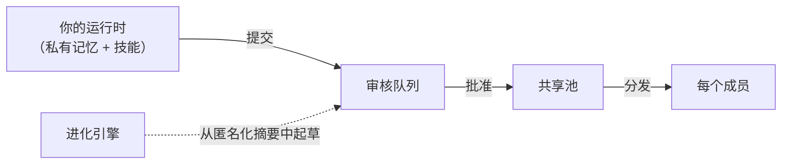

<p align="center">
  
</p>

<h1 align="center">Velaclaw</h1>

<p align="center">
  <strong>用 AI 容易，留下知识很难。</strong><br />
  每个人都在用 AI，但很少有团队真正拥有 AI。Velaclaw 就是为此设计的。
</p>

<Columns cols={2}>
  <Card title="开始使用" href="/start/getting-started" icon="rocket">
    安装 Velaclaw，跑一遍设置向导，五分钟搞定。

  </Card>
  <Card title="组建团队" href="/cn/concepts/team" icon="users">
    加入团队后，每个成员一个独立运行时；共享知识走治理流程。

  </Card>
</Columns>

## Velaclaw 是什么

一个人使用时，你积累的技能、记忆和工作流都是**你自己的**——留在你的机器上，不会上传，也不会被别人看见。

加入团队时，你可以挑一部分提交给团队审核；审核通过后，它们会同步给每个成员。**默认归你自己；要共享得你动手。**

<Columns cols={3}>
  <Card title="私有资产" icon="lock">
    你自己的技能、记忆、工作流。留在本地，永远不会自动共享。

  </Card>
  <Card title="共享资产" icon="users-round">
    经过审核批准的条目，分发给每个团队成员。

  </Card>
  <Card title="进化引擎" icon="sparkles">
    从匿名化的团队使用模式中起草新的共享资产；人工审核才能发布。

  </Card>
</Columns>

## 知识是怎么流动的



没有任何东西能不经人工审核就进入共享池。进化引擎只读取匿名化的会话摘要——永远不读原始对话——它起草的候选资产同样要走审核流程。

## 快速开始

<Steps>
  <Step title="安装">
    ```bash
    npm install -g velaclaw@latest
    ```

  </Step>
  <Step title="跑设置向导">
    ```bash
    velaclaw setup --wizard
    ```
    向导会带你完成 workspace 选择、认证（用你自己的 OpenAI / Anthropic / DeepSeek / Gemini / OpenRouter / LiteLLM API key，或者复用已有的 `claude` / `codex` / `gemini` CLI 登录）、网关绑定。配置写入 `~/.velaclaw/velaclaw.json`，可以重复跑。

  </Step>
  <Step title="启动运行时">
    ```bash
    velaclaw gateway run
    ```
    打开 <strong>http://127.0.0.1:18789</strong>。这是控制面板——对话、会话、agent、配置都在这里。

  </Step>
</Steps>

## 加入团队

<Steps>
  <Step title="构建成员运行时镜像">
    ```bash
    docker build -t velaclaw-member-runtime:local .
    ```

  </Step>
  <Step title="初始化团队 workspace 并启动控制平面">
    ```bash
    velaclaw init my-workspace && cd my-workspace
    velaclaw start
    ```

  </Step>
  <Step title="创建团队并邀请成员">
    ```bash
    velaclaw team create --name "我的团队"
    velaclaw team invitations create my-team \
      --invitee-label "小明" --member-email xiaoming@example.com --role contributor
    velaclaw team invitations accept <邀请码>
    ```

  </Step>
</Steps>

每个成员有一个独立的 Docker 运行时——`cap_drop: ALL`、只读 FS、不挂宿主 socket。知识通过 `提交 → 审核 → 批准 → 分发` 流转。

## 为什么团队选 Velaclaw

<Columns cols={2}>
  <Card title="本地优先" icon="house">
    对话和知识都留在你自己的基础设施上。没有 SaaS 账号，没有远程面板。

  </Card>
  <Card title="自带模型自由" icon="braces">
    OpenAI、Anthropic、Gemini、DeepSeek、Ollama、OpenRouter、LiteLLM，或任意 OpenAI 兼容端点——40+ 供应商。

  </Card>
  <Card title="受控共享" icon="shield-check">
    起草 → 审核 → 批准 → 发布。7 个角色，加上引擎专属的 `system-evolution`。

  </Card>
  <Card title="15 类事件审计" icon="search">
    每一次提交、批准、发布、成员变更、配额调整都有记录、可查询。

  </Card>
  <Card title="心跳与配额" icon="activity">
    成员上报健康状态和当日用量。过期节点在 UI 浮出；按成员强制配额。

  </Card>
  <Card title="备份与恢复" icon="archive">
    `velaclaw team backup <slug>` 一条命令打包整团队状态——成员、资产、审计日志——成 tar.gz。

  </Card>
</Columns>

## 随处可达

Velaclaw 也带一个多通道网关，让成员从已经在用的工具里就能找到自己的 AI：

<Columns cols={3}>
  <Card title="通道" href="/channels/telegram" icon="message-square">
    Discord、Slack、Telegram、WhatsApp、iMessage、Microsoft Teams、Google Chat、Matrix、Zalo 等。

  </Card>
  <Card title="Web 控制面板" href="/web/control-ui" icon="layout-dashboard">
    浏览器仪表板：对话、配置、会话、团队面板。

  </Card>
  <Card title="移动节点" href="/nodes" icon="smartphone">
    配对 iOS 和 Android 节点，支持 Canvas、相机、语音工作流。

  </Card>
</Columns>

## 进一步了解

<Columns cols={3}>
  <Card title="插件 SDK" href="/plugins" icon="plug">
    扩展 Velaclaw——注册资产类型、通道、运行时 hook。

  </Card>
  <Card title="配置" href="/gateway/configuration" icon="settings">
    网关设置、token、provider 配置、环境变量。

  </Card>
  <Card title="安全" href="/gateway/security" icon="lock-keyhole">
    Token、白名单、沙箱、信任边界。

  </Card>
  <Card title="参考" href="/reference" icon="book">
    CLI 命令、API、运行时内部细节。

  </Card>
  <Card title="排查问题" href="/gateway/troubleshooting" icon="wrench">
    网关诊断和常见错误。

  </Card>
  <Card title="帮助" href="/help" icon="life-buoy">
    快速答疑和提问入口。

  </Card>
</Columns>
