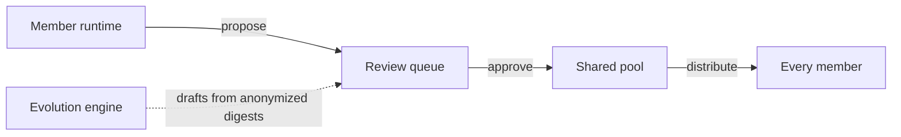

# Teams

Velaclaw runs as a **personal AI runtime** for one user out of the box. When more people join, it grows into a team-scale system without losing two properties that solo runtimes usually give up on:

- **Conversations stay private** — by container boundary, not by policy.
- **Shared knowledge stays governed** — `propose → review → approve → distribute`, with humans deciding what enters the shared pool.

This page explains the moving parts.

## Private and shared assets

Every skill, memory entry, and workflow you accumulate has one of two identities.

<Columns cols={2}>
  <Card title="Private assets" icon="lock">
    Your own skills, memory, and workflows. They stay in **your** runtime,
    are never uploaded, and are never visible to other team members. This
    is the default state of every accumulated piece of knowledge.

  </Card>
  <Card title="Shared assets" icon="users-round">
    Items you have **explicitly proposed** and that your team has reviewed
    and approved. Approved assets are then distributed to every member's
    runtime on their next session.

  </Card>
</Columns>

The asset filesystem layout reflects this directly:

```text
members/<member>/runtime/workspace/
├── private-memory/      ← yours; stays here
├── private-skills/      ← yours; stays here
├── private-tools/       ← yours; stays here
└── private-docs/        ← yours; stays here

teams/<slug>/assets/
├── items/<asset-id>/    ← canonical store (Source of Truth)
└── current/             ← published projection by kind
    ├── shared-memory/
    ├── shared-skills/
    ├── shared-tools/
    ├── shared-workflows/
    └── shared-docs/
```

Sharing an item is always a deliberate move; it is never automatic.

## Isolated member runtimes

Each team member runs in their own Docker container with strict defaults:

- `cap_drop: ALL`
- Read-only filesystem
- No host socket, no privileged namespaces
- A private memory volume that no other container can read

The control plane coordinates members through generated state, APIs, and
**published assets** — not through direct access to anyone's raw conversations.

## The publication flow



Four stages, all visible in the audit trail:

| Stage          | What happens                                                                             |
| :------------- | :--------------------------------------------------------------------------------------- |
| **Propose**    | A member submits an item from their workspace as a draft for the team.                   |
| **Review**     | Anyone with the right role can read, comment on, or request changes to the draft.        |
| **Approve**    | A reviewer with publish permission accepts the draft. Rejected drafts stay in the queue. |
| **Distribute** | Approved assets land in `current/` and sync into every member's `team-shared/` mount.    |

## Roles

Velaclaw ships with seven roles, plus a system role for the evolution engine itself.

| Role               | Can use shared assets | Can propose | Can approve | Can manage members |
| :----------------- | :-------------------: | :---------: | :---------: | :----------------: |
| `viewer`           |           ✓           |             |             |                    |
| `member`           |           ✓           |             |             |                    |
| `contributor`      |           ✓           |      ✓      |             |                    |
| `publisher`        |           ✓           |      ✓      |      ✓      |                    |
| `manager`          |           ✓           |      ✓      |      ✓      |         ✓          |
| `owner`            |           ✓           |      ✓      |      ✓      |  ✓ (incl. owners)  |
| `system-evolution` |           ✓           | ✓ (drafts)  |             |                    |

`system-evolution` is the role attached to the evolution engine when it
drafts new candidates — its proposals always go through the same review
queue and never bypass human approval.

## The evolution engine

Beyond manual proposals, Velaclaw can **draft new shared assets on its own**.

The engine reads only **anonymized session digests** — topics, summaries,
member counts — never raw conversations. From recurring patterns it produces
candidate skills, memory entries, and workflows, which then enter the same
review queue as any human proposal.

Three properties hold:

- **Privacy.** Only anonymized metadata leaves the member runtime.
- **Human in the loop.** Every draft goes through review before reaching anyone.
- **Incremental.** The engine remembers what it has already produced and skips duplicates across runs.

## Audit trail

Every team event is logged and queryable. The 15 tracked event types include:

- `member.invited`, `member.joined`, `member.left`, `member.quota.changed`
- `asset.proposed`, `asset.reviewed`, `asset.approved`, `asset.rejected`,
  `asset.published`, `asset.revoked`
- `team.created`, `team.role.granted`, `team.role.revoked`
- `evolution.run.started`, `evolution.run.finished`

The full log lives in `state/audit/` and ships with the team backup.

## Backup and restore

A team's full state — members, private and shared assets, audit log,
quotas — packs into a single tarball:

```bash
velaclaw team backup my-team             # writes my-team-<timestamp>.tar.gz
velaclaw team restore my-team-<ts>.tar.gz
```

## Heartbeat and quota

Members report health and per-day usage through a heartbeat. The control
plane surfaces stale nodes in the UI and enforces quotas per member.

```bash
velaclaw team members list <team-slug>
velaclaw team members quota <team-slug> <member-id> --daily-messages 200
```

## Related

<Columns cols={2}>
  <Card title="Get started" href="/start/getting-started" icon="rocket">
    Solo install + setup wizard.

  </Card>
  <Card title="Plugin SDK" href="/plugins" icon="plug">
    Extend Velaclaw — register custom asset types, channels, runtime hooks.

  </Card>
</Columns>
