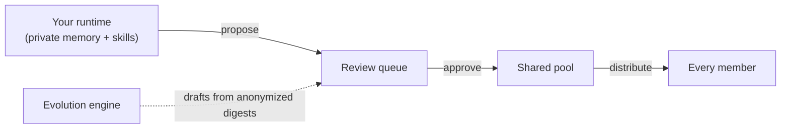

<p align="center">
  
</p>

<h1 align="center">Velaclaw</h1>

<p align="center">
  <strong>Using AI is easy; making knowledge stick is hard.</strong><br />
  Everyone on your team is using AI, but few teams really own what comes out of it. Velaclaw is built for that.
</p>

<Columns cols={2}>
  <Card title="Get started" href="/start/getting-started" icon="rocket">
    Install Velaclaw and run the setup wizard in five minutes.

  </Card>
  <Card title="Team setup" href="/concepts/team" icon="users">
    Add your team. Each member gets an isolated runtime; shared knowledge stays governed.

  </Card>
</Columns>

## What Velaclaw is

When you use it alone, the skills, memory, and workflows you build up are **your own** — they stay on your machine, never uploaded, never visible to anyone else.

When a team joins, you can hand selected items over for review; once the team approves, they are synced to every member. **What's yours stays yours by default; sharing takes a deliberate move.**

<Columns cols={3}>
  <Card title="Private assets" icon="lock">
    Your own skills, memory, workflows. Stay local. Never auto-shared.

  </Card>
  <Card title="Shared assets" icon="users-round">
    Reviewed-and-approved items distributed to every team member.

  </Card>
  <Card title="Evolution engine" icon="sparkles">
    Drafts new shared assets from anonymized team patterns; humans approve.

  </Card>
</Columns>

## How knowledge moves



Nothing reaches the shared pool without explicit human review. The evolution engine reads only anonymized session digests — never raw conversations — and drafts candidates that still go through the same approval path.

## Quick start

<Steps>
  <Step title="Install">
    ```bash
    npm install -g velaclaw@latest
    ```

  </Step>
  <Step title="Run the wizard">
    ```bash
    velaclaw setup --wizard
    ```
    The wizard walks you through workspace, auth (bring your own API key for OpenAI / Anthropic / DeepSeek / Gemini / OpenRouter / LiteLLM, or reuse a `claude` / `codex` / `gemini` CLI login), and gateway binding. Configuration lands in `~/.velaclaw/velaclaw.json` and is safe to re-run.

  </Step>
  <Step title="Start the runtime">
    ```bash
    velaclaw gateway run
    ```
    Open <strong>http://127.0.0.1:18789</strong>. That's the Control UI — chat, sessions, agents, and config in one place.

  </Step>
</Steps>

## Add your team

<Steps>
  <Step title="Build the member runtime image">
    ```bash
    docker build -t velaclaw-member-runtime:local .
    ```

  </Step>
  <Step title="Initialize a team workspace and start the control plane">
    ```bash
    velaclaw init my-workspace && cd my-workspace
    velaclaw start
    ```

  </Step>
  <Step title="Create a team and invite a member">
    ```bash
    velaclaw team create --name "My Team"
    velaclaw team invitations create my-team \
      --invitee-label "Alice" --member-email alice@example.com --role contributor
    velaclaw team invitations accept <invite-code>
    ```

  </Step>
</Steps>

Each member gets an isolated Docker runtime — `cap_drop: ALL`, read-only FS, no host socket. Knowledge moves through `propose → review → approve → distribute`.

## Why teams pick Velaclaw

<Columns cols={2}>
  <Card title="Local-first by default" icon="house">
    Conversations and knowledge stay on your infrastructure. No SaaS account; no remote dashboard.

  </Card>
  <Card title="Bring your own model" icon="braces">
    OpenAI, Anthropic, Gemini, DeepSeek, Ollama, OpenRouter, LiteLLM, or any OpenAI-compatible endpoint — 40+ providers.

  </Card>
  <Card title="Governed sharing" icon="shield-check">
    Draft → review → approve → publish. 7 roles plus an `system-evolution` role for the engine itself.

  </Card>
  <Card title="15-event audit trail" icon="search">
    Every proposal, approval, publish, membership change, and quota update is logged and queryable.

  </Card>
  <Card title="Heartbeat & quota" icon="activity">
    Members report health and daily-message usage. Stale nodes surface in the UI; per-member quotas are enforced.

  </Card>
  <Card title="Backup & restore" icon="archive">
    `velaclaw team backup <slug>` packs the full team state — members, assets, audit log — into a tar.gz.

  </Card>
</Columns>

## Connect anywhere

Velaclaw also includes a multi-channel gateway so members can reach their AI from wherever they already work:

<Columns cols={3}>
  <Card title="Channels" href="/channels/telegram" icon="message-square">
    Discord, Slack, Telegram, WhatsApp, iMessage, Microsoft Teams, Google Chat, Matrix, Zalo, and more.

  </Card>
  <Card title="Web Control UI" href="/web/control-ui" icon="layout-dashboard">
    Browser dashboard for chat, configuration, sessions, and team panel.

  </Card>
  <Card title="Mobile nodes" href="/nodes" icon="smartphone">
    Pair iOS and Android nodes for Canvas, camera, and voice-enabled workflows.

  </Card>
</Columns>

## Explore further

<Columns cols={3}>
  <Card title="Plugin SDK" href="/plugins" icon="plug">
    Extend Velaclaw — register asset types, channels, or runtime hooks.

  </Card>
  <Card title="Configuration" href="/gateway/configuration" icon="settings">
    Gateway settings, tokens, provider config, and environment variables.

  </Card>
  <Card title="Security" href="/gateway/security" icon="lock-keyhole">
    Tokens, allowlists, sandboxing, and trust boundaries.

  </Card>
  <Card title="Reference" href="/reference" icon="book">
    CLI commands, APIs, and runtime internals.

  </Card>
  <Card title="Troubleshooting" href="/gateway/troubleshooting" icon="wrench">
    Gateway diagnostics and common errors.

  </Card>
  <Card title="Help" href="/help" icon="life-buoy">
    Quick fixes and where to ask.

  </Card>
</Columns>
