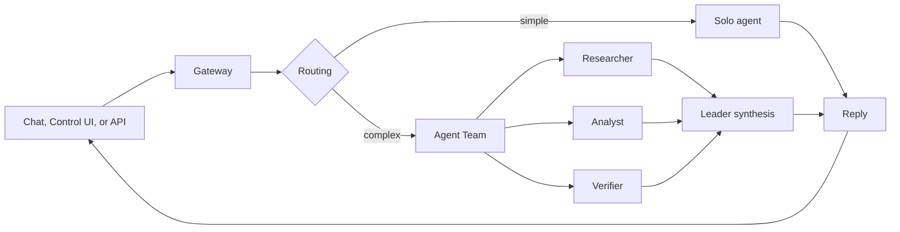

# Introduction

VelaClaw is a local-first AI runtime for people who want an assistant they can reach from chat, the browser, and team workflows without handing the whole operating model to a hosted service.

At the center is the Gateway. It receives a message, decides the session and agent route, runs the assistant with the right workspace and tools, and sends the result back through the same surface. For simple work, that can be one agent. For harder work, VelaClaw can use an Agent Team: temporary read-only helper agents that gather evidence, analyze tradeoffs, and verify gaps while the leader agent owns the final answer.

## Core ideas

<Columns>
  <Card title="Gateway" icon="route">
    The Gateway is the message and session router for channels, tools, agents, and UI surfaces.
  </Card>
  <Card title="Agent Team" icon="users">
    A per-request team of helper agents can split research, analysis, and verification work.
  </Card>
  <Card title="Control UI" icon="monitor">
    The browser UI gives you chat, configuration, sessions, nodes, and local inspection.
  </Card>
  <Card title="Team workspace" icon="library">
    Organization teams add member runtimes, shared assets, review flow, audit logs, and backups.
  </Card>
</Columns>

## Agent Team in one minute

Agent Team is not a permanent chat room of bots. It is a temporary execution pattern for one user turn.

When a request is broad enough to benefit from parallel work, VelaClaw can route it into one of three modes:

- `solo` - one agent handles straightforward questions and narrow tasks.
- `assist` - one or two read-only helpers support the leader on research, comparison, review, or verification.
- `team` - researcher, analyst, and verifier helpers run in parallel for broader multi-part tasks.

The leader agent remains responsible for the final response. Helpers are treated as untrusted context and are read-only by default, so they can collect and check information without writing files, sending messages, committing, deploying, or changing external state.

You can let VelaClaw auto-assist on complex requests, or ask explicitly with phrases such as `agent team`, `multi-agent`, `parallel agents`, or `开多 agent`.

## How the pieces fit

For individual use, this gives one assistant the ability to split hard work safely. For organization use, Teams can capture useful outcomes as reviewed shared assets and distribute them back to member runtimes.

## Choose your path

<Columns>
  <Card title="First setup" href="/start/getting-started" icon="rocket">
    Install VelaClaw, configure a model provider, and send the first message.
  </Card>
  <Card title="Agent Team and Teams" href="/start/teams" icon="users">
    Understand temporary Agent Team routing and organization team workspaces.
  </Card>
  <Card title="Channels" href="/channels" icon="message-square">
    Connect WhatsApp, Telegram, Discord, Microsoft Teams, Slack, and more.
  </Card>
  <Card title="Gateway configuration" href="/gateway/configuration" icon="settings">
    Tune routing, auth, model providers, sessions, tools, and safety controls.
  </Card>
</Columns>
