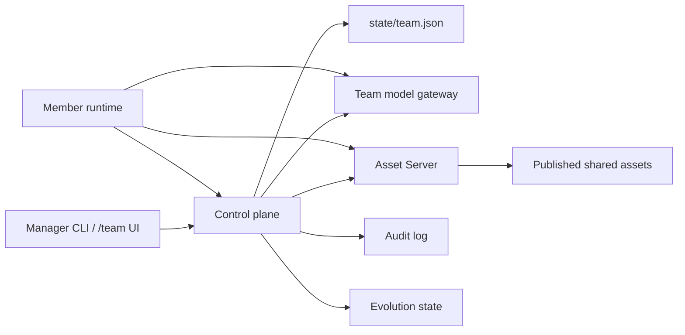
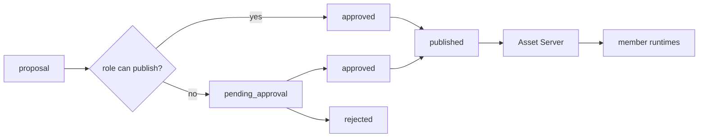
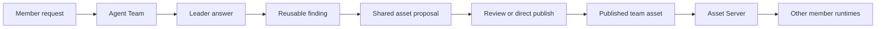

# Teams

VelaClaw uses "team" for two related systems:

- **Agent Team**: a temporary, per-request group of read-only helper agents coordinated by one leader agent.
- **Organization Teams**: persistent workspaces with members, invitations, member runtimes, shared assets, model gateway access, audit logs, quotas, backup, restore, and evolution.

Agent Team improves one answer by splitting work. Organization Teams preserve useful work by turning reusable knowledge into reviewed shared assets that can be distributed to member runtimes.

## Agent Team

Agent Team is session-local. It does not create members or a persistent workspace. The router decides whether the current user turn should stay solo, use one or two helpers, or run a fuller team.

<Columns>
  <Card title="Researcher" icon="search">
    Collects facts, sources, project context, and relevant evidence.
  </Card>
  <Card title="Analyst" icon="chart-line">
    Compares options, reasons through tradeoffs, and structures conclusions.
  </Card>
  <Card title="Verifier" icon="shield">
    Checks stale facts, missing tests, contradictions, gaps, and unsupported claims.
  </Card>
  <Card title="Leader" icon="route">
    Synthesizes the final answer and owns every write or high-risk action.
  </Card>
</Columns>

| Mode     | When it runs                                                                               | Helper count       |
| -------- | ------------------------------------------------------------------------------------------ | ------------------ |
| `solo`   | Simple Q&A, narrow tasks, low-confidence cases, or high-risk write tasks                   | 0                  |
| `assist` | Complex requests that benefit from independent research, analysis, review, or verification | 1-2                |
| `team`   | Broad multi-part requests that benefit from researcher, analyst, and verifier roles        | Up to 3 by default |

The default explicit triggers include phrases such as `agent team`, `multi-agent`, `parallel agents`, `开多 agent`, and `并行分析`. Helpers are read-only: they can gather evidence and produce findings, but they should not write files, edit code, send messages, delete data, commit, push, deploy, purchase, install, or change external state. The leader treats helper output as untrusted context and still owns the final answer.

```json5
{
  personalTeam: {
    enabled: true,
    autoAssist: true,
    maxAgents: 3,
    maxSpawnDepth: 1,
    writerPolicy: "leader_only",
    confidenceThreshold: 0.72,
  },
}
```

## Organization Teams Architecture

Organization Teams are implemented as a control plane plus one isolated member runtime per accepted member.



The workspace is created with `velaclaw init <dir>`. It scaffolds the control-plane root, member template, team state, audit log, evolution state, shared asset directories, and artifacts directory. `velaclaw start` starts the control plane, which listens on `http://127.0.0.1:4318` by default and writes a persisted control-plane state file so member runtimes know how to call back.

<Note>
Admin routes are loopback-only unless `VELACLAW_ADMIN_TOKEN` is set. Member runtimes do not use the admin token; they receive scoped runtime, model gateway, panel, and asset server tokens generated from team state.
</Note>

## Control Plane State

The canonical team state lives under `state/team.json`. Each `TeamState` contains:

| Field               | Purpose                                                                           |
| ------------------- | --------------------------------------------------------------------------------- |
| `profile`           | Name, slug, description, manager label, invite path, timestamps                   |
| `modelGateway`      | Team-scoped provider id, allowed model ids, upstream settings, and gateway tokens |
| `invitations`       | Pending, accepted, or revoked invitation records                                  |
| `memberPolicies`    | Role, quota, asset permissions, runtime access token, Telegram mapping            |
| `assetRolePolicies` | Per-role shared asset permissions                                                 |
| `assets`            | Shared asset records and lifecycle metadata                                       |
| `evolution`         | Evolution engine config for scheduled or forced asset generation                  |

The control plane mutates this state through a serialized mutation queue, so team updates write back to `state/team.json` in order.

## Roles And Permissions

Default asset permissions are role-based:

| Role               | Propose | Publish without approval | Approve | Promote |
| ------------------ | ------- | ------------------------ | ------- | ------- |
| `owner`            | yes     | yes                      | yes     | yes     |
| `manager`          | yes     | yes                      | yes     | yes     |
| `operator`         | yes     | yes                      | yes     | yes     |
| `publisher`        | yes     | yes                      | no      | no      |
| `contributor`      | yes     | no                       | no      | no      |
| `member`           | yes     | no                       | no      | no      |
| `viewer`           | no      | no                       | no      | no      |
| `system-evolution` | yes     | yes                      | no      | no      |

Member management is narrower: only `owner`, `manager`, and `operator` can remove other members through the member-runtime panel route. Members cannot remove themselves.

Default quotas are also role-aware:

| Role family        | Daily messages | Monthly messages | Max subagents | Max thinking |
| ------------------ | -------------- | ---------------- | ------------- | ------------ |
| `owner`, `manager` | 500            | 12000            | 3             | `medium`     |
| Other roles        | 150            | 3000             | 1             | `medium`     |

`velaclaw team members quota` can change role, daily/monthly message quotas, and active/paused status. The member runtime receives the updated policy and applies it through the `member-quota-guard` plugin.

## Team Lifecycle

<Steps>
  <Step title="Initialize a workspace">
    ```bash
    velaclaw init my-workspace
    cd my-workspace
    ```

    The workspace contains `members/member-template`, `state`, `state/audit`, `state/evolution`, `teams`, `team-assets`, and `artifacts`.

  </Step>
  <Step title="Start the control plane">
    ```bash
    velaclaw start
    ```

    The local UI is available at `http://127.0.0.1:4318`. For Docker members, the callback URL defaults to `http://host.docker.internal:4318` unless `VELACLAW_TEAM_CONTROL_BASE_URL` is set.

  </Step>
  <Step title="Create a team">
    ```bash
    velaclaw team create \
      --name "Product Team" \
      --slug product-team \
      --manager-label "Team Lead"
    ```
  </Step>
  <Step title="Invite and accept a member">
    ```bash
    velaclaw team invitations create product-team \
      --invitee-label "Alice" \
      --member-email alice@example.com \
      --role contributor

    velaclaw team invitations accept <invite-code> --identity-name "Alice"
    ```

  </Step>
</Steps>

Accepting an invitation provisions the member runtime, writes its team policy, syncs managed local plugins, and marks the invitation as accepted.

## Member Runtime Provisioning

When an invitation is accepted, VelaClaw copies `members/member-template` into `members/<team>/<member>`, then generates the runtime files.

| Generated path                    | What it contains                                              |
| --------------------------------- | ------------------------------------------------------------- |
| `runtime/docker-compose.yml`      | Docker Compose service for the member runtime                 |
| `runtime/config/velaclaw.json`    | Member Gateway, agent, tools, plugin, and model configuration |
| `runtime/config/team-policy.json` | Team role, quota, runtime token, and invitation metadata      |
| `runtime/config/team-usage.json`  | Daily/monthly quota usage counters                            |
| `runtime/workspace/`              | The member's active workspace and `AGENTS.md`                 |
| `runtime/secrets/`                | Per-member secrets such as optional Telegram bot token file   |

The generated Compose service uses the `velaclaw-member-runtime:local` image, exposes the member Gateway on `127.0.0.1:<member-port>:18789`, and starts ports from `18800`. The container is intentionally restricted:

- `cap_drop: ALL`
- `security_opt: no-new-privileges:true`
- `read_only: true`
- tmpfs-backed `/tmp`
- `pids_limit: 256`
- `mem_limit: 2g`
- `cpus: 1.5`
- isolated bridge network
- read-only mount of published team assets

Each member also gets private mounted buckets: `private-memory`, `private-skills`, `private-tools`, and `private-docs`. Published team assets mount read-only into both `/srv/team-shared` and the workspace `team-shared` directory.

## Member Runtime Configuration

The generated member config is intentionally conservative:

- Gateway mode is local, with token auth and the Responses HTTP endpoint enabled.
- The default agent is `main` and uses the team model gateway provider.
- Tools start with the `minimal` profile, add `read`, keep `tools.fs.workspaceOnly: true`, and disable elevated tools.
- `exec` is configured with gateway host execution, allowlist security, and `ask: "always"`.
- Cron, `sessions_spawn`, `subagents`, and `lobster` are denied in the generated baseline.
- The `shared-asset-injector`, `member-quota-guard`, `team-panel`, and `member-runtime-upgrader` plugins are enabled.

The `AGENTS.md` template tells member runtimes to check active shared assets before inventing policy, keep private notes separate from team assets, and promote reusable decisions only through review.

## Managed Member Plugins

| Plugin                    | Implementation behavior                                                                                                                                                |
| ------------------------- | ---------------------------------------------------------------------------------------------------------------------------------------------------------------------- |
| `member-quota-guard`      | Reads `team-policy.json` and `team-usage.json`, blocks paused members, enforces daily/monthly message quota, and can block subagents when quota policy disallows them. |
| `shared-asset-injector`   | Calls the team Asset Server, resolves relevant published assets, writes active docs/config/skills into the workspace, and injects selected context into prompts.       |
| `team-panel`              | Lets a member runtime reach the team panel APIs for overview, evolution trigger, and member removal where the role allows it.                                          |
| `member-runtime-upgrader` | Registers `/upgrade`, which asks the control plane to restart the current member runtime.                                                                              |

These plugins are copied from the managed member template into each member runtime during provisioning and quota/config sync.

## Team Model Gateway

Member runtimes do not need direct upstream model keys. They talk to the control plane through:

```text
/api/teams/:slug/model-gateway/v1
```

The control plane exposes OpenAI-compatible `models`, `chat/completions`, and `responses` endpoints. It validates the team model gateway token, rejects models outside `allowedModelIds`, maps the requested model when needed, then forwards to the configured upstream provider.

This lets the manager keep upstream credentials on the control-plane side while members only receive the team gateway token and allowed model list.

## Shared Assets

Shared assets are the durable knowledge layer for Organization Teams. Built-in asset categories are:

| Category           | Family     | Asset Server kind | Materialization target      |
| ------------------ | ---------- | ----------------- | --------------------------- |
| `shared-memory`    | knowledge  | `memory`          | prompt prepend, active docs |
| `shared-skills`    | capability | `skills`          | active skills               |
| `shared-tools`     | config     | `tools`           | config overlay              |
| `shared-workflows` | process    | `workflows`       | prompt prepend, active docs |
| `shared-docs`      | knowledge  | `docs`            | prompt prepend, active docs |

Assets move through this lifecycle:



The proposal command accepts inline content or a file:

```bash
velaclaw team assets propose product-team \
  --category shared-workflows \
  --title "Incident rollback checklist" \
  --file ./rollback.md \
  --submitted-by-member-id alice-example-com
```

Review commands:

```bash
velaclaw team assets list product-team
velaclaw team assets approve product-team <asset-id> --approved-by-member-id manager
velaclaw team assets reject product-team <asset-id> --reason "too narrow"
velaclaw team assets promote product-team <asset-id> --actor-id manager
```

Published assets are written into a canonical item store and legacy projections under `teams/<slug>/assets`. Member runtimes consume the published view through the Asset Server, not by mutating team state directly.

## Asset Server

The Asset Server is token-authenticated and mounted into each member runtime through `shared-asset-injector`.

| Endpoint                                      | Purpose                                             |
| --------------------------------------------- | --------------------------------------------------- |
| `GET /api/teams/:slug/asset-server/manifest`  | Published asset metadata                            |
| `GET /api/teams/:slug/asset-server/bundle`    | Published assets grouped by kind, including content |
| `GET /api/teams/:slug/asset-server/registry`  | Capability registry without full content            |
| `GET /api/teams/:slug/asset-server/items/:id` | One asset item                                      |
| `POST /api/teams/:slug/asset-server/resolve`  | Resolve relevant assets for a query                 |
| `GET /api/teams/:slug/asset-server/events`    | SSE stream for asset changes                        |

Resolution can use a dynamic LLM router or lexical fallback. It can also include ClawHub shared skills when `VELACLAW_TEAM_CLAWHUB_SKILLS_ENABLED=1`; the control plane resolves and downloads ClawHub assets while member runtimes only receive materialized files.

## Heartbeats And Runtime Actions

Member runtimes can post heartbeat payloads to:

```text
POST /api/teams/:slug/members/:id/heartbeat
```

The control plane stores heartbeat state in memory and treats heartbeats older than about two minutes as stale. Runtime control is available per member or in batch:

```bash
curl -X POST http://127.0.0.1:4318/api/teams/product-team/members/<id>/runtime/restart
curl -X POST http://127.0.0.1:4318/api/teams/product-team/members/batch/restart
```

The underlying implementation shells out to `docker compose` or passwordless `sudo -n docker compose` using the member's generated compose file.

## Evolution Engine

The evolution engine turns repeated member-session patterns into shared asset proposals.

Default config:

```json5
{
  evolution: {
    enabled: false,
    intervalMs: 86400000,
    minSessionsToTrigger: 5,
    maxDigestSummaries: 50,
    autoPublish: true,
  },
}
```

When it runs, it scans member session metadata and transcripts from each member's `main` agent, skips sessions seen before the last evolution run, builds anonymized topics and summaries, and asks the team model gateway to synthesize reusable `[MEMORY]` or `[SKILL]` blocks. Generated assets are submitted by `system-evolution` as `shared-memory` or `shared-skills`.

Manual trigger:

```bash
curl -X POST http://127.0.0.1:4318/api/teams/product-team/evolution/trigger
```

The team panel can also trigger evolution through its panel API. Scheduled runs respect `enabled`, `intervalMs`, and `minSessionsToTrigger`.

## Backup And Restore

Backups are tar archives created under `artifacts` unless an output path is provided.

```bash
velaclaw team backup product-team
velaclaw team restore ./artifacts/product-team-backup-20260512T150000Z.tar.gz
velaclaw team restore ./backup.tar.gz --force
```

Each backup includes:

- `manifest.json`
- `team-state.json`
- `members/`
- `teams/<slug>/` assets
- `audit.jsonl` when present

Restore validates the backup schema, refuses to overwrite an existing team unless `--force` is used, restores members and assets, then backfills the canonical asset item store and rebuilds projections.

## CLI Surface

Common commands:

```bash
velaclaw team list
velaclaw team create --name "Product Team"
velaclaw team show product-team

velaclaw team invitations list product-team
velaclaw team invitations create product-team --invitee-label "Alice" --member-email alice@example.com
velaclaw team invitations accept <invite-code>
velaclaw team invitations revoke product-team <invitation-id>

velaclaw team members list product-team
velaclaw team members quota product-team <member-id> --role contributor --daily-messages 250
velaclaw team members remove product-team <member-id>

velaclaw team assets list product-team
velaclaw team assets propose product-team --category shared-docs --title "Runbook" --file ./runbook.md
velaclaw team assets approve product-team <asset-id>
velaclaw team assets reject product-team <asset-id> --reason "needs edits"
velaclaw team assets promote product-team <asset-id>

velaclaw team backup product-team
velaclaw team restore ./backup.tar.gz
```

Maintenance commands also exist for asset migrations:

```bash
velaclaw team assets backfill-items product-team
velaclaw team assets rebuild-projections product-team
```

## UI And API Surface

The built-in control-plane UI exposes:

- `/team` - team list and create form
- `/team/:slug` - members, invitations, assets, audit entries, and evolution status

The JSON API mirrors the CLI and adds runtime/panel/asset/model endpoints:

- `/api/teams`
- `/api/teams/:slug`
- `/api/teams/:slug/invitations`
- `/api/team/invitations/:code/accept`
- `/api/teams/:slug/assets/*`
- `/api/teams/:slug/members/*`
- `/api/teams/:slug/audit`
- `/api/teams/:slug/evolution/*`
- `/api/teams/:slug/backup`
- `/api/teams/:slug/restore`
- `/api/teams/:slug/model-gateway/v1/*`
- `/api/teams/:slug/asset-server/*`
- `/api/teams/:slug/panel/*`

## How Agent Team And Organization Teams Combine

A member can use Agent Team inside their own runtime to handle a hard request. If the result produces a reusable checklist, skill, memory, workflow, or runbook, that output can become a shared asset proposal. A manager, owner, operator, or publisher then moves it through the governed asset lifecycle.



The important boundary is that private member context is not automatically team policy. Members can propose reusable assets, but published team knowledge is created through an explicit control-plane flow.

## Next Steps

<Columns>
  <Card title="Getting Started" href="/start/getting-started" icon="rocket">
    Install VelaClaw and run your first assistant session.
  </Card>
  <Card title="Personal assistant setup" href="/start/velaclaw" icon="book-open">
    Configure an assistant workspace, channel, sessions, media, and safety defaults.
  </Card>
  <Card title="Configuration" href="/gateway/configuration" icon="settings">
    Tune model providers, gateway auth, channels, tools, and runtime behavior.
  </Card>
  <Card title="Microsoft Teams channel" href="/channels/msteams" icon="message-square">
    Set up the Microsoft Teams channel integration. This is separate from VelaClaw team mode.
  </Card>
</Columns>
